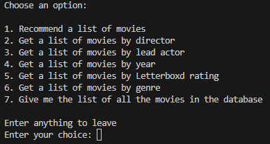

# EA1

This exploration activity is focused on the Pandas library for Python. Pandas is a library that is used for data analysis and manipulation. It uses data frames for the structure for its tables.

This program uses a movieData.txt that contains films that came out in 2023 and the filmographies of a few well-known directors. 

It prompts the user to select a myriad of different options to print a list of movies. 

One of them being a option to recommend the user a list of movies based on a given genre and rating. Which would be the main purpose for the program